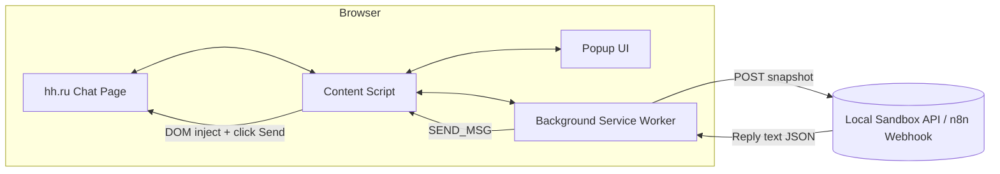

# HH Chat Sandbox Chrome Extension

A minimal, **load‑unpacked Chrome extension** + optional local API sandbox that lets you:

* Inspect **hh.ru / employer.hh.ru** chat pages while logged in.
* Capture the currently open chat thread (message list, who said what, timestamps).
* Send a reply *programmatically* from an extension popup (injects into the page just like a user typing + clicking send).
* Forward chat snapshots to a local development endpoint (Node/Express, n8n webhook, etc.) for processing (logging, AI reply, CRM sync).

This repo is intentionally lightweight so you can iterate quickly, swap selectors when HH changes its DOM, and bolt on downstream automations.

---

## Contents

* [Architecture](#architecture)
* [Repo Layout](#repo-layout)
* [Quick Start](#quick-start)
* [Configuration](#configuration)
* [Development Workflow](#development-workflow)
* [Selectors Cheat Sheet](#selectors-cheat-sheet)
* [Local Sandbox API](#local-sandbox-api)
* [Security & Privacy Notes](#security--privacy-notes)
* [Testing Checklist](#testing-checklist)
* [Troubleshooting](#troubleshooting)
* [Roadmap / TODO](#roadmap--todo)
* [Codex Bootstrap Prompt](#codex-bootstrap-prompt) ← copy/paste to generate / regenerate code
* [License](#license)

---

## Architecture



**Key idea:** we *drive the DOM* instead of calling private HH APIs. Because we are in the logged‑in user context, HH’s own JS handles auth, cookies, CSRF, etc.

---

## Repo Layout

```
hh-chat-sandbox/
├─ manifest.json              # Manifest V3 config
├─ background.js              # Message router; forwards to API; relays replies
├─ content.js                 # Runs in hh.ru chat pages; reads + sends messages
├─ popup/
│   ├─ popup.html             # Minimal UI
│   └─ popup.js               # Renders current chat + send box
├─ util/
│   └─ api.example.js         # Optional Express stub (localhost:4000)
├─ .gitignore
└─ README.md                  # (this file)
```

---

## Quick Start

> **Prereqs:** Chrome / Chromium‑based browser (Brave, Edge), Node 18+ if you want the local API, hh.ru employer account with chat messages.

1. **Clone:**

   ```bash
   git clone <your-fork-url> hh-chat-sandbox && cd hh-chat-sandbox
   ```
2. (Optional) Install deps for the local API stub:

   ```bash
   npm install
   npm run dev   # runs util/api.example.js on http://localhost:4000
   ```
3. **Load extension:**

   * Open `chrome://extensions/`
   * Toggle **Developer mode** (top right)
   * Click **Load unpacked** → select the `hh-chat-sandbox` folder
4. Log in to your **hh.ru / employer.hh.ru** account in a tab.
5. Open any chat (URL looks like `https://ufa.hh.ru/chat/<id>` or employer variant).
6. Click the extension icon → see messages → type a reply → **Send**.
7. Watch your terminal (if local API running) for inbound snapshots.

---

## Configuration

Basic configuration lives inline in `manifest.json` and `content.js`.

### Domains / host permissions

Update in **manifest.json** if you see chats under different subdomains:

```json
"host_permissions": [
  "*://*.hh.ru/*",
  "*://employer.hh.ru/*",
  "http://localhost:4000/*"
]
```

### Selectors

HH can (and will) change DOM attributes. Inspect the chat page (DevTools) and update these constants in `content.js`:

```js
const ROOT = '[data-qa="chat-messages-root"]';
const INPUT = '[data-qa="chat-input"] [contenteditable]';
const SEND  = '[data-qa="chat-send-button"]';
```

See [Selectors Cheat Sheet](#selectors-cheat-sheet) for tips.

### Local API URL

Edit the fetch URL in `background.js` if your endpoint differs:

```js
const INBOX_URL = 'http://localhost:4000/inbox';
```

---

## Development Workflow

**Iteration loop:**

1. Open chat in hh.ru.
2. Change code (e.g., tweak selector).
3. `chrome://extensions` → click **Reload** on the extension.
4. Refresh the chat tab.
5. Use popup to re‑dump messages and send test replies.

**Debugging:**

* Right‑click the extension icon → *Inspect popup*.
* In `chrome://extensions`, click *Service worker* link under the extension to view background logs.
* `console.log` in `content.js` shows up in the **page devtools console** (since it runs in that page).

---

## Selectors Cheat Sheet

Because HH uses dynamic attributes, try these fallback strategies when selectors break:

| Target             | Primary selector                                   | Fallback idea                                                  |
| ------------------ | -------------------------------------------------- | -------------------------------------------------------------- |
| Message root       | `[data-qa="chat-messages-root"]`                   | Div with role="log" or scroll container near URL param chat id |
| Individual message | `[data-qa^="chat-message"]`                        | Elements w/ attr `data-msg-id`, or class substring `message_`  |
| Outgoing/incoming  | CSS class such as `message-out` vs `message-in`    | Use an avatar container test (your vs candidate)               |
| Input editable     | `[contenteditable][data-qa="chat-input-textarea"]` | Last contenteditable in footer                                 |
| Send button        | `[data-qa="chat-send-button"]`                     | Button with paper‑plane icon aria‑label="Send"                 |

Use DevTools → copy selector.

---

## Local Sandbox API

`util/api.example.js` spins a tiny HTTP server you can fork into n8n or a full backend.

### Endpoints

| Method | Path     | Purpose                                          | Body                       |
| ------ | -------- | ------------------------------------------------ | -------------------------- |
| POST   | `/inbox` | Receive chat snapshots from extension background | `{ chat, messages:[...] }` |
| POST   | `/reply` | Queue a reply (simulate AI/CRM)                  | `{ chat, text }`           |

When `/reply` is called the example server pings the extension via `chrome.runtime.sendMessage`? **No** — extensions can’t accept arbitrary inbound network calls. Instead the background script can **poll** `/outbox` or you can build a **WebSocket** client in the background to receive replies.

### Minimal polling strategy

* Background timer (e.g., every 5s) → `GET /pending?chat=<id>`
* If JSON contains `{text:"..."}` → background relays `SEND_MSG` to content → DOM sends.

---

## Security & Privacy Notes

| Concern              | Guidance                                                                                                           |
| -------------------- | ------------------------------------------------------------------------------------------------------------------ |
| Candidate PII        | Treat all messages & résumés as personal data; encrypt at rest; avoid logging raw full text in shared consoles.    |
| HH Terms             | Use only on accounts you own / have written permission to automate; high‑volume scripted outreach may violate ToS. |
| Credentials          | Extension stores no credentials; relies on logged‑in browser session.                                              |
| Rate / Bot detection | Randomize delays before sending; avoid sending >1 msg/sec.                                                         |

---

## Testing Checklist

* [ ] Extension loads without errors in `chrome://extensions`.
* [ ] Opens popup on hh.ru chat tab and displays message count.
* [ ] Snapshot updates when a new candidate message arrives (test with a second browser / test account).
* [ ] Reply typed in popup appears in the hh.ru UI as if manually sent.
* [ ] Snapshot forwarded to local API (watch console).
* [ ] Local API returns a suggested reply → delivered back into chat (after you implement polling / push).

Advanced:

* [ ] Handles multi‑line messages.
* [ ] Captures timestamps.
* [ ] Distinguishes inbound vs outbound correctly.
* [ ] Survives HH DOM change (fallback selectors tested).

---

## Troubleshooting

**Popup says “Not a chat tab”**

> The content script didn’t run or domain not matched. Confirm URL pattern in `manifest.json`.

**Messages array empty**

> Update selectors in `content.js`. Inspect DOM to see actual attributes.

**Nothing sends**

> Confirm `document.execCommand` still works; if not, set the element’s `textContent` followed by synthetic `KeyboardEvent('Enter')`.

**Background fetch blocked**

> Check CORS; for localhost dev you may need to disable / add headers in Express stub.

---

## Roadmap / TODO

**MVP (v0.1)**

* [ ] DOM selectors verified for current hh.ru chat UI
* [ ] Snapshot capture + popup display
* [ ] Manual send from popup
* [ ] Forward snapshot to local API

**v0.2**

* [ ] Poll local API for pending replies; auto‑send
* [ ] Config page (options.html) to set API base URL per user
* [ ] Persist chat history in `chrome.storage.local`

**v0.3**

* [ ] Integrate OpenAI (call from background or server) for auto screening questions
* [ ] Map candidate ID → lead in amoCRM via API token
* [ ] Multi‑chat sidebar within popup

**v0.4**

* [ ] Typing indicator simulation, random delays
* [ ] Attachment capture (links to files if exposed in DOM)
* [ ] Export conversation JSON → download

**Stretch**

* [ ] Role‑based access (multiple recruiters)
* [ ] Firebase/Firestore sync
* [ ] Offscreen document for long‑lived WebSocket to server

---

## Codex Bootstrap Prompt

> Copy everything between the triple backticks and paste into your coding assistant (GitHub Copilot Chat, OpenAI o4‑mini‑high, etc.) to generate or regenerate the repo.

```text
You are an expert Chrome Extension + automation engineer. Generate a **minimal sandbox Chrome extension (Manifest V3)** that reads and sends chat messages on hh.ru chat pages (URL pattern `*://*.hh.ru/chat/*`).

### Goals
1. Capture current chat messages from DOM.
2. Display them in a popup UI.
3. Allow user to type a reply in the popup and send it into the chat as if typed in the HH UI.
4. Forward every snapshot to `http://localhost:4000/inbox` (JSON POST) for server‑side experimentation (n8n / Node / AI).

### Requirements
- Manifest V3.
- Content script runs on matches: `*://*.hh.ru/chat/*`.
- Background service worker receives `CHAT_SNAPSHOT` messages from content; forwards to server.
- Popup requests current state via runtime message, renders message log + textarea + Send.
- Popup clicking Send → background → tabs.sendMessage to content → content injects text & clicks send.
- Minimal CSS/HTML; clarity over styling.
- Provide `util/api.example.js` Express stub with `/inbox` logging.
- Provide npm scripts: `dev` runs the Express stub.
- Provide `.gitignore` (node_modules, .env, dist, *.pem).
- Provide README quick‑start snippet (extension load, run API).

### Implementation notes
- Use constants at top of content.js for selectors (`ROOT`, `INPUT`, `SEND`). Add TODO comments instructing maintainers to inspect the DOM if these break.
- In `dumpChat()` collect: {id, me:boolean, ts, text} for each message element.
- Use MutationObserver on the messages root to trigger new snapshots.
- Use `document.execCommand('insertText', false, msg.text)` then click send.
- Background caches last snapshot per tab in memory.
- When popup opens, request cached state with {type:'GET_STATE', tabId} message.
- Use action badge text to show message count.

### Output
Produce the full file set:
- manifest.json
- background.js
- content.js
- popup/popup.html
- popup/popup.js
- util/api.example.js
- package.json (scripts: dev)
- README.md (short)

Return all files as concatenated markdown code blocks with clear filenames.
```

---

## License

Internal sandbox. Choose a license (MIT recommended) when you make the repo public.

---

### Next Step

Let me know when you create the GitHub repo (paste URL or org/name) and I’ll generate the initial code bundle for you to commit.
